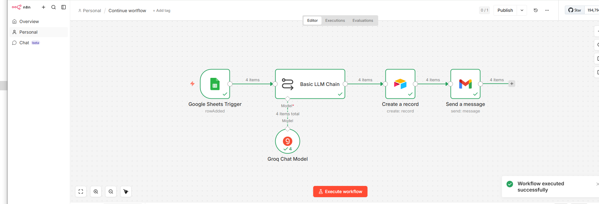

# AI Customer Service Auto-Responder

## Overview

The AI Customer Service Auto-Responder is an n8n workflow that automatically generates customer service email responses using Groq AI. The workflow receives customer requests, creates AI-generated replies, stores interaction records in Airtable, and sends notifications through Gmail.

This automation helps businesses respond to customer inquiries faster while maintaining consistent communication.

---

## Business Problem

Customer service teams spend significant time writing repetitive responses to common customer questions. This manual process slows response times and reduces team productivity.

---

## Solution

This workflow automatically:

- Detects new customer requests.
- Uses Groq AI to generate response drafts.
- Stores customer interaction records in Airtable.
- Sends responses through Gmail.

---

## Workflow Overview

The screenshot below shows the actual n8n workflow built for this project.



---

## Technologies Used

- n8n
- Google Sheets Trigger
- Groq Chat Model
- Airtable
- Gmail

---

## Workflow

```text
Google Sheets Trigger
        │
        ▼
Groq Chat Model
        │
        ▼
Airtable
        │
        ▼
Gmail
```

---

## Business Value

- AI-generated customer responses
- Faster response times
- Improved consistency
- Automated record keeping
- Reduced manual effort

---

## Key Features

- AI response generation
- Airtable integration
- Gmail notifications
- Automated workflow
- Easy customization

---

## Future Improvements

- Multi-language responses
- Sentiment analysis
- CRM integration
- Human approval workflow
- Analytics dashboard

---

## Author

**Samuel Favour**

AI Automation Specialist

GitHub: https://github.com/SamFavour-Lab
